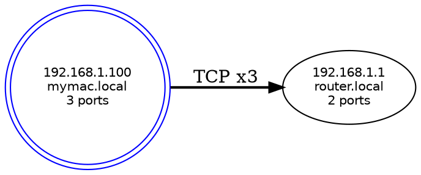

# netopo — 项目总控文档

> 本文档是所有 agent 的最高权威。任何 agent 的行为与本文档冲突时，以本文档为准。
> 本文档同时是 arbiter_agent 判断项目是否达到完成度的唯一标准。

---

## 一、项目定义

### 是什么

`netopo` 是一个运行在终端的**本地网络拓扑探测与可视化工具**，用 Rust 编写。

用户打开终端，输入一条命令，就能在 30 秒内看到：
- 当前局域网里有哪些设备（IP、hostname、开放了哪些端口）
- 这些设备之间正在发生哪些 TCP/UDP 连接
- 整张网络拓扑图——可以是 ASCII 图、Graphviz dot 文件，或者一个好看的 TUI 交互界面

### 目标用户

- DevOps / 网络工程师：快速了解局域网拓扑，排查连接问题
- 开发者：在本机查看服务间依赖关系
- 安全研究员：发现未知设备和异常连接

### 不是什么

- 不是 nmap 的替代品（不做漏洞扫描）
- 不是持续监控系统（没有告警、没有历史数据库）
- 不依赖任何云服务或 AI

---

## 二、核心功能规格（Arbiter 验收标准的依据）

以下每条功能，arbiter_agent 必须逐一验证已实现，才能给出 SHIP_IT。

### F1 — 本机网卡扫描
- 自动枚举本机所有网络接口（含 loopback、以太网、WiFi、VPN 虚拟接口）
- 输出每个接口的：接口名、IP 地址、子网掩码、MAC 地址、是否为默认网关接口
- 标记哪个接口是"主接口"（有默认路由的那个）
- 实现方式：`pnet` crate 的 `datalink::interfaces()`

### F2 — 局域网设备扫描
- 对用户指定的 CIDR（默认 `192.168.1.0/24`）进行扫描
- 扫描方式：并发 TCP connect 探测（不发 ICMP，不需要 root）
- 对每个响应的 IP，尝试 DNS 反向解析获取 hostname
- 探测常用端口（默认列表见下方），记录哪些端口开放
- 默认探测端口：`21, 22, 23, 25, 53, 80, 110, 143, 443, 445, 3306, 3389, 5432, 5900, 6379, 8080, 8443, 8888, 9200, 27017`
- 支持 `--ports` 参数自定义端口列表
- 并发数：默认 256 个并发连接，`--concurrency` 可调
- 超时：单个连接默认 500ms，`--timeout` 可调

### F3 — TCP/UDP 连接追踪
- 获取当前主机上所有活跃的 TCP/UDP 连接快照
- 每条连接记录：本地 IP:Port、远端 IP:Port、协议、连接状态（TCP 专有）
- 跨平台实现：
  - **Linux**：读取 `/proc/net/tcp`、`/proc/net/tcp6`、`/proc/net/udp`，解析十六进制地址
  - **macOS**：执行 `netstat -an -p tcp` 和 `netstat -an -p udp`，解析文本输出
  - **Windows**：调用 `GetExtendedTcpTable` / `GetExtendedUdpTable` WinAPI
- 支持 `--watch N` 参数，每 N 秒刷新一次快照
- 过滤选项：`--local-only`（只显示局域网内连接）、`--exclude-loopback`

### F4 — 拓扑图构建
- 将 Node + Edge 数据构建为有向图（使用 `petgraph::Graph`）
- 去重：相同 IP 的多条连接合并为一条边，附带连接计数
- 识别"本机节点"，在所有输出格式中高亮显示
- 支持过滤：`--min-connections N`（只显示连接数 ≥ N 的节点）

### F5 — 输出格式：JSON
- `--output-json <FILE>` 将完整 Graph 序列化为 JSON
- JSON 结构严格遵守第四节 Schema 定义

### F6 — 输出格式：Graphviz dot
- `--output-dot <FILE>` 生成 `.dot` 文件，可用 `dot -Tpng` 渲染
- 要求：
  - 本机节点用双边框（`shape=doublecircle`），蓝色
  - 边的粗细反映连接数（`penwidth`）
  - TCP 用实线，UDP 用虚线（`style=dashed`）
  - 节点标签：IP + hostname（如有）+ 开放端口数量
  - 整体使用 `rankdir=LR`（左右布局）

示例输出：


### F7 — 输出格式：ASCII 拓扑图
- `--ascii` 在终端直接打印拓扑图
- 必须对齐美观，80 列终端下不换行
- 设计规范：
  - 本机节点用 `[★ IP]` 标识，其他节点用 `[IP]`
  - TCP 连接：`──TCP:PORT──►`，UDP 连接：`╌╌UDP:PORT╌╌►`
  - 节点下方显示 hostname 和开放端口

示例输出：
```
╔══════════════════════════════════════╗
║           netopo 拓扑图               ║
║    扫描时间: 2024-01-15 10:30:00      ║
╚══════════════════════════════════════╝

  [★ 192.168.1.100]  mymac.local
         │
         ├──TCP:443──► [192.168.1.1]   router.local
         │                   └── 开放端口: 80, 443
         │
         ├──TCP:3306─► [192.168.1.50]  db-server.local
         │                   └── 开放端口: 3306
         │
         └──UDP:53───► [8.8.8.8]       dns.google

  共 4 个节点，7 条连接
```

### F8 — TUI 可视化界面
- `--tui` 启动交互式终端界面，使用 `ratatui` + `crossterm`
- 界面布局（严格实现，Arbiter 会核查每个区域）：

```
┌─────────────────────────────────────────────────────────┐
│  netopo  v0.1.0          [扫描中...] / [最后更新: 10:30] │
├────────────────────────┬────────────────────────────────┤
│  节点列表 (4)           │  连接详情                       │
│ ──────────────────────  │ ─────────────────────────────── │
│ ★ 192.168.1.100        │  选中: 192.168.1.1              │
│   192.168.1.1    [路由] │  入站连接: 3                    │
│   192.168.1.50   [数据] │  出站连接: 1                    │
│   8.8.8.8        [DNS]  │  开放端口: 80, 443              │
│                         │  Hostname: router.local         │
├────────────────────────┴────────────────────────────────┤
│  拓扑图 (ASCII 渲染)                                      │
│  [★]──TCP──►[路由]──►[互联网]                            │
├─────────────────────────────────────────────────────────┤
│  [q]退出  [r]刷新  [↑↓]选择  [f]过滤  [e]导出JSON  [?]帮助│
└─────────────────────────────────────────────────────────┘
```

- 颜色方案：
  - 本机节点：`Color::LightBlue` + 加粗
  - 活跃 TCP 连接数值：`Color::Green`
  - UDP 连接数值：`Color::Yellow`
  - 无响应节点：`Color::DarkGray`
  - 标题栏：深蓝背景白字（`bg=Blue, fg=White`）
  - 状态栏：黑底绿字（`bg=Black, fg=Green`）
  - 选中行：反色高亮（`Modifier::REVERSED`）

- 交互键（全部必须实现）：
  - `q` / `Ctrl+C`：退出程序
  - `r`：立即重新扫描并刷新界面
  - `↑` `↓`：节点列表上下移动，右侧面板实时更新
  - `f`：弹出过滤输入框（按 IP 或 hostname 筛选节点）
  - `e`：导出当前拓扑为 JSON，弹出文件名输入提示
  - `Tab`：在节点列表面板和拓扑图面板间切换焦点
  - `?`：显示帮助覆盖层，列出所有快捷键

---

## 三、模块结构（锁定）

```
src/
├── main.rs              # CLI 入口，仅负责解析参数 + 组装模块调用，禁止写业务逻辑
├── cli.rs               # clap 参数定义，所有 --flag 在此声明
├── data_manager.rs      # 唯一数据类型定义（Node/Edge/Graph）+ serde 实现
├── scanner.rs           # F1 + F2：网卡枚举、子网扫描、端口探测
├── connection_tracker.rs # F3：TCP/UDP 连接快照，三平台实现
├── graph_builder.rs     # F4：petgraph 封装，Graph 构建与查询
└── visualization.rs     # F5 + F6 + F7 + F8：全部输出格式实现
```

---

## 四、数据 Schema（锁定）

```rust
// data_manager.rs — 全项目唯一数据类型来源，其他模块不得自定义等价类型

use serde::{Deserialize, Serialize};

#[derive(Debug, Clone, Serialize, Deserialize)]
pub struct Node {
    pub ip: String,
    pub hostname: Option<String>,
    pub ports: Vec<u16>,
    pub is_local: bool,
    pub mac: Option<String>,
    pub interface: Option<String>,
}

#[derive(Debug, Clone, Serialize, Deserialize)]
pub struct Edge {
    pub src: String,
    pub dst: String,
    pub protocol: String,        // "TCP" | "UDP"
    pub src_port: u16,
    pub dst_port: u16,
    pub state: Option<String>,   // "ESTABLISHED" | "TIME_WAIT" | ...
    pub count: u32,              // 合并后的连接数
}

#[derive(Debug, Clone, Serialize, Deserialize)]
pub struct Graph {
    pub nodes: Vec<Node>,
    pub edges: Vec<Edge>,
    pub captured_at: String,     // RFC3339 时间戳
    pub local_ip: String,
    pub summary: GraphSummary,
}

#[derive(Debug, Clone, Serialize, Deserialize)]
pub struct GraphSummary {
    pub total_nodes: usize,
    pub total_edges: usize,
    pub tcp_connections: usize,
    pub udp_connections: usize,
    pub scan_duration_ms: u64,
}
```

---

## 五、依赖（Cargo.toml 锁定）

```toml
[dependencies]
clap        = { version = "4",   features = ["derive"] }
serde       = { version = "1",   features = ["derive"] }
serde_json  = "1"
tokio       = { version = "1",   features = ["full"] }
petgraph    = "0.6"
pnet        = "0.34"
ratatui     = "0.26"
crossterm   = "0.27"
chrono      = { version = "0.4", features = ["serde"] }
anyhow      = "1"
thiserror   = "1"
dns-lookup  = "2"

[target.'cfg(target_os = "linux")'.dependencies]
procfs = "0.16"

[target.'cfg(target_os = "windows")'.dependencies]
winapi = { version = "0.3", features = ["iphlpapi", "winsock2"] }

[dev-dependencies]
mockall    = "0.12"
tokio-test = "0.4"
```

---

## 六、CLI 完整规范

```
USAGE:
    netopo [OPTIONS]

扫描选项:
    --scan                    扫描局域网设备（自动检测主接口子网）
    --subnet <CIDR>           指定扫描网段，如 10.0.0.0/24
    --ports <LIST>            指定端口，如 "22,80,443" 或 "1-1024"
    --concurrency <N>         并发连接数，默认 256
    --timeout <MS>            单连接超时毫秒，默认 500

连接选项:
    --connections             获取当前 TCP/UDP 连接快照
    --local-only              只显示局域网内连接
    --exclude-loopback        排除 loopback 连接
    --watch <SECONDS>         每 N 秒刷新，默认 5

图构建:
    --graph                   构建拓扑图
    --min-connections <N>     只显示连接数 ≥ N 的节点

输出格式:
    --output-json <FILE>      输出 JSON 文件
    --output-dot <FILE>       输出 Graphviz dot 文件
    --ascii                   终端打印 ASCII 拓扑图
    --tui                     启动 TUI 交互界面

通用:
    -v, --verbose             详细输出
    -q, --quiet               静默模式
    -h, --help                帮助
    -V, --version             版本

常用组合:
    netopo --scan --ascii
    netopo --scan --connections --tui
    netopo --scan --output-json result.json
    netopo --connections --watch 10 --ascii
    netopo --scan --subnet 10.0.0.0/24 --output-dot net.dot
```

---

## 七、迭代循环协议

### Orchestrator 核心职责
收到启动指令后**不得停下来等待用户确认**，持续运行迭代直到满足 STOP 条件。

### 每轮迭代步骤（严格按序）

```
Step 1  读取 docs/progress.md，确认当前轮次和模块状态
Step 2  读取 reports/blockers.md，存在 BLOCKER 优先处理
Step 3  Task → architect_agent    补全 design/ 中缺失的设计文档
Step 4  Task → developer_agent    实现 TODO/BLOCKED 的模块
Step 5  Task → tester_agent       执行 Red-Green 测试协议
Step 6  Task → doc_agent          更新 docs/ + README.md
Step 7  Task → reviewer_agent     代码审查，输出 reports/review_N.md
Step 8  Task → devops_agent       检查构建、clippy、跨平台兼容
Step 9  Task → git_agent          cargo test 通过后执行 commit
Step 10 每 3 轮执行 Task → arbiter_agent（裁决是否 SHIP_IT）
Step 11 满足 STOP 条件则停止，否则更新轮次回到 Step 1
```

### 迭代上限
最多 20 轮。第 20 轮后写入 `reports/timeout.md` 并停止。

---

## 八、STOP 条件（全部 ✓ 才能停止）

### 代码质量
- [ ] `cargo test --all` 零失败
- [ ] `cargo clippy -- -D warnings` 零 warning
- [ ] `cargo build` 成功
- [ ] `cargo fmt --check` 无问题
- [ ] 无裸 `unwrap()` 在非测试代码中

### 功能完整性（逐一核查 F1–F8）
- [ ] F1：能列出所有网络接口，标记主接口
- [ ] F2：能扫描子网设备并探测端口
- [ ] F3：能获取 TCP/UDP 连接快照（当前平台）
- [ ] F4：Node + Edge 能正确构建 petgraph，去重合并
- [ ] F5：JSON 输出符合 Schema 定义
- [ ] F6：dot 文件能被 `dot -Tpng` 成功渲染
- [ ] F7：ASCII 图有 ★ 标识，80 列下不错位
- [ ] F8：TUI 四个区域布局正确，8 个交互键全部可用，颜色方案正确

### 测试覆盖
- [ ] 每个模块 line coverage ≥ 70%
- [ ] TUI 测试使用 `TestBackend`，不依赖真实终端
- [ ] connection_tracker 有 Linux/macOS 两套解析的单元测试

### 文档完整性
- [ ] `README.md`：安装、快速开始、CLI 参数示例
- [ ] `docs/tutorial.md`：覆盖 F1–F8 所有功能，含真实命令输出示例
- [ ] `docs/structure.md`：每个文件的职责与实现状态
- [ ] `docs/progress.md`：完整迭代历史
- [ ] `docs/lesson_learned.md`：至少记录 3 条真实问题

### 用户体验
- [ ] `netopo --help` 参数分组清晰
- [ ] 权限不足时给出友好提示（"需要 sudo"）而非 panic
- [ ] ASCII 图在 80 列终端下不换行不错位
- [ ] TUI 在 `TERM=xterm-256color` 下颜色正常

---

## 九、禁止行为（所有 agent 必须遵守）

- **禁止**在循环中途询问用户"是否继续"
- **禁止**在 `main.rs` 中写业务逻辑
- **禁止** tester_agent 跳过 Red 阶段
- **禁止**声明模块完成而不先运行 `cargo build` 验证
- **禁止** doc_agent 复制代码注释充当文档
- **禁止** git_agent 在 `cargo test` 未通过时执行 commit
- **禁止** arbiter_agent 凭感觉给出 SHIP_IT，必须逐项核查第八节清单

---

## 十、首次运行 Bootstrap

如果 `docs/progress.md` 不存在，在启动第一轮前执行：

```bash
git init
git add .
git commit -m "chore: initial project scaffold"
```

并创建初始 `docs/progress.md`（内容见第七节）。

---

## 十一、使用模型

所有 subagent 使用 `claude-sonnet-4-5`。
