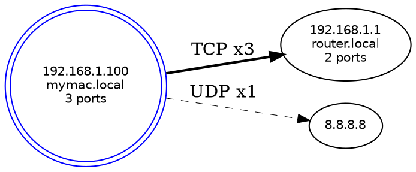

# netopo 使用教程

> 本文档由 doc_agent 维护，覆盖 F1–F8 全部功能的实际用法与输出示例。

---

## F1 — 本机网卡扫描

`netopo --scan` 触发时会首先枚举本机所有网络接口。

```bash
netopo --scan --ascii
```

执行后，程序会在 stderr 打印接口发现信息：

```
发现 3 个本机接口
扫描子网: 192.168.1.0/24 ...
发现 5 个活跃主机
```

netopo 用 `pnet::datalink::interfaces()` 枚举所有接口（含 loopback、以太网、WiFi、VPN），通过 `route -n get default`（macOS）或 `ip route show default`（Linux）识别主接口，并将其对应的节点标记 `is_local = true`，在 ASCII 图中显示为 `[★ IP]`。

---

## F2 — 局域网设备扫描

### 基本用法：扫描默认子网

```bash
netopo --scan --ascii
```

`--scan` 不指定 `--subnet` 时，自动从主接口 IP 推算其所在子网（例如主接口 IP 为 `192.168.1.100/24`，则扫描 `192.168.1.0/24`）。

### 指定子网

```bash
netopo --scan --subnet 10.0.0.0/24 --ascii
```

### 自定义端口和并发参数

```bash
netopo --scan --ports "22,80,443,8080" --concurrency 100 --timeout 300 --ascii
```

`--ports` 支持逗号分隔列表（`"22,80,443"`）和范围写法（`"1-1024"`）。

### 输出示例

```
╔══════════════════════════════════════╗
║           netopo 拓扑图               ║
║  扫描时间: 2026-03-23T10:30:05+08:00  ║
╚══════════════════════════════════════╝

  [★ 192.168.1.100]  mymac.local

  共 6 个节点，0 条连接
```

（仅 `--scan` 不加 `--connections` 时，拓扑图只有节点，没有连接线）

---

## F3 — TCP/UDP 连接追踪

### 获取当前连接快照

```bash
netopo --connections --ascii
```

stderr 输出：
```
获取到 47 条活跃连接
```

stdout ASCII 拓扑图：
```
╔══════════════════════════════════════╗
║           netopo 拓扑图               ║
║  扫描时间: 2026-03-23T10:31:00+08:00  ║
╚══════════════════════════════════════╝

  [★ 192.168.1.100]  mymac.local
         ├──TCP:  443──►  [140.82.114.25]
         ├──TCP:  443──►  [172.217.0.14]
         ├──TCP: 3306──►  [192.168.1.50]  db-server.local
         │                └── 开放端口: 3306
         └──UDP:   53──►  [8.8.8.8]

  共 5 个节点，4 条连接
```

### 只显示局域网连接

```bash
netopo --connections --local-only --ascii
```

只保留 dst 为私有地址（10.x.x.x、192.168.x.x、172.16-31.x.x）的连接。

### 排除 loopback

```bash
netopo --connections --exclude-loopback --ascii
```

过滤掉 src 或 dst 为 `127.x.x.x` 和 `::1` 的连接。

### watch 模式（持续监控）

```bash
netopo --connections --watch 5 --ascii
```

每 5 秒抓取一次连接快照并重新打印 ASCII 图，Ctrl+C 退出。

---

## F4 — 拓扑图构建

`graph_builder` 在每次运行时自动调用，无需额外命令。以下选项控制图的过滤行为：

### 过滤低频节点

```bash
netopo --connections --min-connections 2 --ascii
```

只显示参与了至少 2 条连接的节点。本机节点无论连接数多少都保留。

### 连接去重说明

相同的 (src_ip, dst_ip, protocol, dst_port) 四元组会合并为一条 Edge，`count` 字段记录出现次数。在 dot 文件中，边的粗细（`penwidth`）与 `count` 成正比；在 ASCII 图中，连接箭头上标注端口号。

---

## F5 — JSON 输出

```bash
netopo --scan --connections --output-json topology.json
```

生成 `topology.json` 文件，stderr 打印确认：

```
发现 3 个本机接口
扫描子网: 192.168.1.0/24 ...
发现 5 个活跃主机
获取到 47 条活跃连接
JSON 已写入: topology.json
```

JSON 结构示例（节选）：

```json
{
  "nodes": [
    {
      "ip": "192.168.1.100",
      "hostname": "mymac.local",
      "ports": [22, 80, 443],
      "is_local": true,
      "mac": "a4:83:e7:12:34:56",
      "interface": "en0"
    },
    {
      "ip": "192.168.1.1",
      "hostname": "router.local",
      "ports": [80, 443],
      "is_local": false,
      "mac": null,
      "interface": null
    }
  ],
  "edges": [
    {
      "src": "192.168.1.100",
      "dst": "192.168.1.1",
      "protocol": "TCP",
      "src_port": 54321,
      "dst_port": 443,
      "state": "ESTABLISHED",
      "count": 3
    }
  ],
  "captured_at": "2026-03-23T10:30:05+00:00",
  "local_ip": "192.168.1.100",
  "summary": {
    "total_nodes": 2,
    "total_edges": 1,
    "tcp_connections": 1,
    "udp_connections": 0,
    "scan_duration_ms": 1243
  }
}
```

---

## F6 — Graphviz dot 输出

```bash
netopo --scan --connections --output-dot network.dot
```

stderr 确认：
```
dot 已写入: network.dot
```

生成的 `network.dot` 内容示例：



渲染为 PNG 图片：

```bash
dot -Tpng network.dot -o network.png
```

dot 格式规范：
- 本机节点：`shape=doublecircle`，蓝色
- 边粗细：`penwidth` = 1.0 到 5.0，与 `count` 成正比（每个连接 +0.5）
- TCP 连接：实线；UDP 连接：`style=dashed` 虚线
- 节点标签：IP + hostname（如有）+ 开放端口数量
- 整体布局：`rankdir=LR`（左右排列）

---

## F7 — ASCII 拓扑图

```bash
netopo --scan --connections --ascii
```

完整输出示例（模拟办公网络场景）：

```
╔══════════════════════════════════════╗
║           netopo 拓扑图               ║
║  扫描时间: 2026-03-23T10:30:05+08:00  ║
╚══════════════════════════════════════╝

  [★ 192.168.1.100]  mymac.local
         ├──TCP:  443──►  [192.168.1.1]        router.local
         │                └── 开放端口: 80, 443
         ├──TCP: 3306──►  [192.168.1.50]       db-server.local
         │                └── 开放端口: 3306
         ├──TCP:   22──►  [192.168.1.20]       dev-box.local
         │                └── 开放端口: 22
         └──UDP:   53──►  [8.8.8.8]

  共 5 个节点，4 条连接
```

格式说明：
- 本机节点：`[★ IP]`，其他节点：`[IP]`
- TCP 连接：`──TCP:PORT──►`
- UDP 连接：`╌╌UDP:PORT╌╌►`
- 所有行截断至 80 列，保证在标准终端不换行
- 最后一条出站连接用 `└`，中间连接用 `├`

---

## F8 — TUI 交互界面

```bash
netopo --scan --connections --tui
```

### 界面布局

```
┌─────────────────────────────────────────────────────────┐
│  netopo  v0.1.0          [最后更新: 2026-03-23T10:30:05]  │  ← 标题栏（深蓝背景白字）
├────────────────────────┬────────────────────────────────┤
│  节点列表 (5)           │  连接详情                       │
│ ──────────────────────  │ ─────────────────────────────── │
│ ★ 192.168.1.100 [本机]  │  选中: 192.168.1.1              │
│ ► 192.168.1.1   [Web]  │  入站连接: 3                    │  ← 绿色数值
│   192.168.1.50  [数据]  │  出站连接: 0                    │  ← 绿色数值
│   192.168.1.20  [SSH]  │  开放端口: 80, 443              │
│   8.8.8.8              │  Hostname: router.local          │
├────────────────────────┴────────────────────────────────┤
│  拓扑图 (ASCII 渲染)                                      │
│  [★192.168.1.100] ──TCP──►[192.168.1.1] ──TCP──►[...] │
├─────────────────────────────────────────────────────────┤
│  [q]退出  [r]刷新  [↑↓]选择  [f]过滤  [e]导出JSON  [Tab]切换  [?]帮助  │  ← 黑底绿字
└─────────────────────────────────────────────────────────┘
```

### 交互键

| 按键 | 功能 |
|------|------|
| `q` 或 `Ctrl+C` | 退出 TUI |
| `r` | 触发刷新（显示刷新提示） |
| `↑` / `↓` | 节点列表上下移动，右侧面板实时更新 |
| `f` | 弹出过滤输入框，按 IP 或 hostname 筛选节点，回车或 Esc 确认 |
| `e` | 弹出导出输入框（默认文件名 `netopo_export.json`），回车确认，Esc 取消 |
| `Tab` | 在节点列表面板和拓扑图面板间切换焦点 |
| `?` | 显示帮助覆盖层，列出所有快捷键，任意键关闭 |

### 颜色方案

| 元素 | 颜色 |
|------|------|
| 标题栏 | 深蓝背景白字加粗 |
| 本机节点（★） | `LightBlue` 加粗 |
| 无端口节点（离线/未知） | `DarkGray` |
| 入站/出站连接数值 | `Green` |
| 状态栏 | 黑底绿字 |
| 选中行 | 反色高亮（`REVERSED`） |

### 导出 JSON 操作流程

1. 在 TUI 中按 `e`
2. 底部状态栏变为：`[导出] 文件名: netopo_export.json▌  (Enter 确认, Esc 取消)`
3. 可修改文件名，回车后 JSON 写入磁盘
4. 状态栏显示：`JSON 已写入: netopo_export.json`

### 过滤操作流程

1. 按 `f`，状态栏变为：`[过滤] 输入关键词: ▌`
2. 输入 IP 前缀或 hostname 关键词，节点列表实时过滤
3. 回车或 Esc 退出过滤模式，选中索引重置为 0
